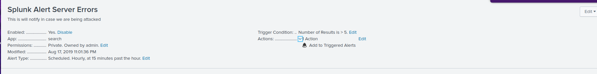
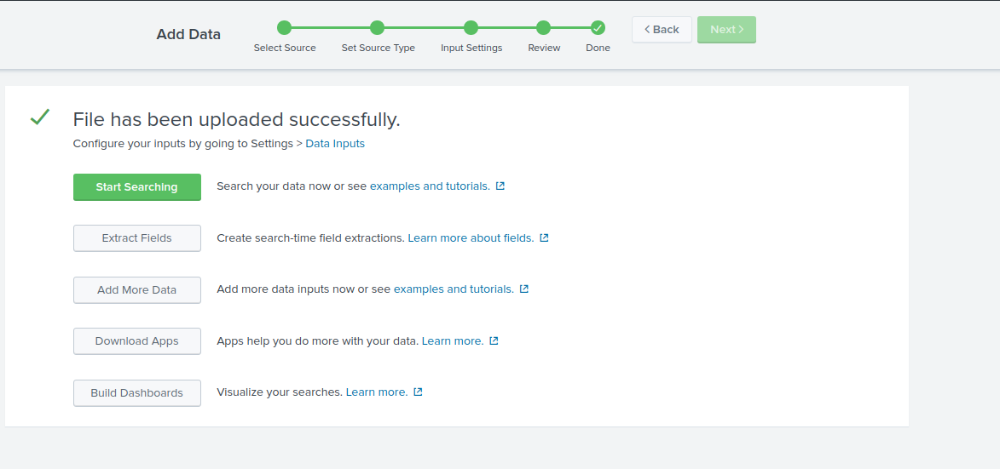
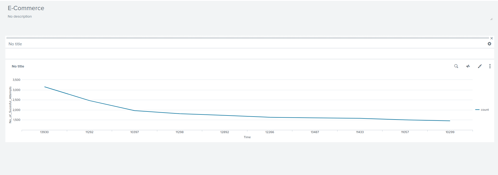
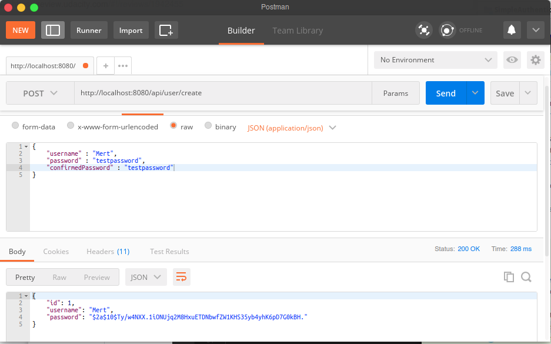
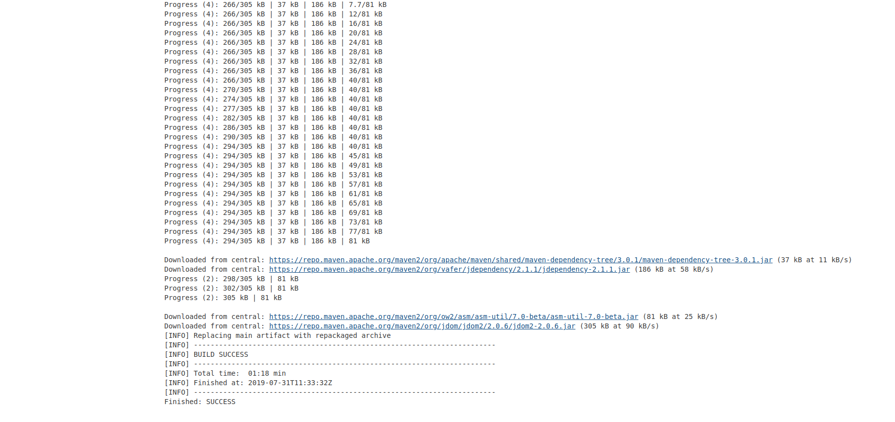

# eCommerce Application

### Code Coverage

The target test coverage has been attained and the results are depicted in the picture below
Please remember that I have two broad testing modules they both sum up to meet the target

### Setting Up the Alerts
I included logs inside my code in order to trace and I also set up alerts. The alert is there to signal when a particular query is made. Below is a screen capture to illustrate this.

Also I indexed logs into splunk , below is a capture of the successful uploads of the log files.
 

### DashBoard
below is a vizualisation of the createUser sucesstime per minute.

### Password Validation
The code was updated in orer to satisfy the rubrics for the password validation and confirmed password too, below is a screen capture to show this

### Proper Branching
This is a link to the github repo of the project with proper branching and all the commits have been inserted.

`https://github.com/Mert-Can/JDND`

### build

- link to successful build can be found at `http://ec2-13-229-198-115.ap-southeast-1.compute.amazonaws.com:8080/job/eCommerce/5/console
`

